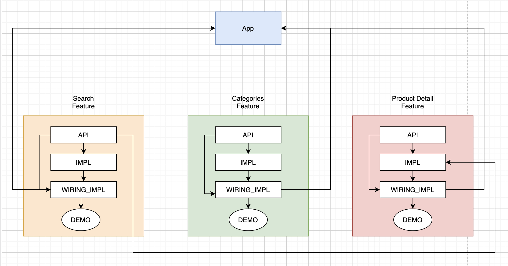

# Mercado Libre Challenge
This is a simple project created to demonstrate some of the skills I have, in this project I decided to create a strong architecture where allows having hundreds of modules without affecting the compilation time. 

The image below shows how the architecture is and each feature is composed of 3 modules, separating the business logic in a module called impl, presenting the feature through interfaces where is able to share what you need to be used for other features, the wiring_impl is this module where binds the interfaces with the implementation of the business logic and having this as a reference to the app component.

The idea with this architecture is that we can separate the logic of features and create mini demos to run the feature individually helping to run and make changes to the feature faster.

## Features

- Browse between categories
- Search products by categories
- Search products by query
- Search results pagination
- Product detail with more information about the product and seller
- Clear searches and allow search again

## Demo 

## Tech

For this project I use the following technologies:

- [RXJava] : <https://github.com/ReactiveX/RxAndroid>
- [Retrofit] : <https://square.github.io/retrofit>
- [Dagger 2] : <https://dagger.dev/dev-guide/android.html>
- [Epoxy] : <https://github.com/airbnb/epoxy>
- [Navigation Component] : <https://developer.android.com/guide/navigation>
- [ViewModel] : <https://developer.android.com/topic/libraries/architecture/viewmodell>
- [Glide] : <https://github.com/bumptech/glide>
- [Mockito] : <https://site.mockito.org>
- [Espresso] : <https://developer.android.com/training/testing/espresso>
- [MockWebServer] : <https://github.com/square/okhttp/tree/master/mockwebserver>
- [IdLingResource] : <https://developer.android.com/training/testing/espresso/idling-resource>
